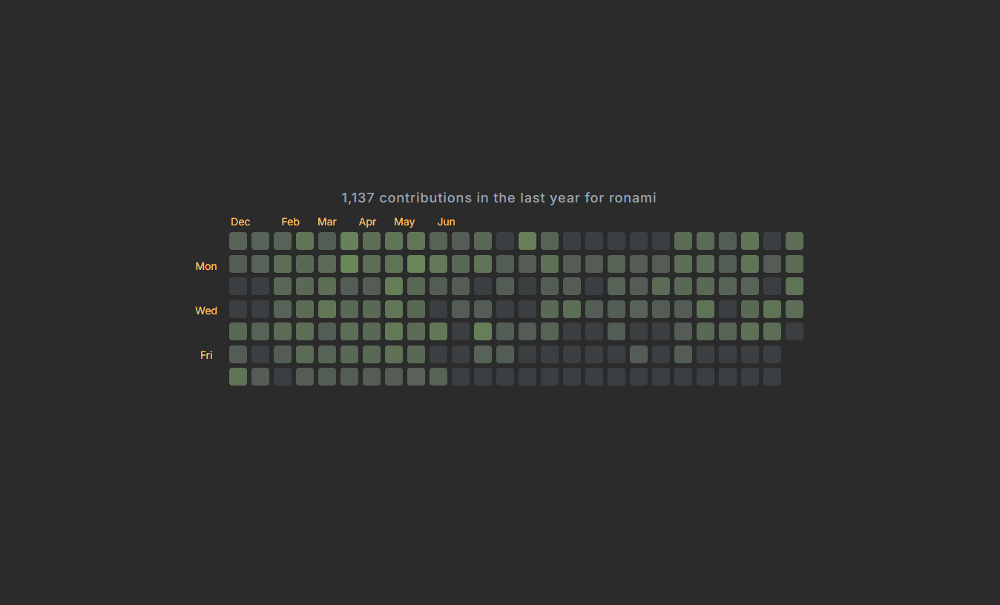

# GitHub Contributions Wallpaper for Wallpaper Engine

This project provides a dynamic wallpaper for Wallpaper Engine that displays your GitHub contributions over the past year. It allows you to choose between multiple themes and shows the number of contributions for each day.

## Features

- **Dynamic GitHub Contributions**: Display your contributions on a daily basis, with visual feedback.
- **Customizable Themes**: Choose from several color themes including "GitHub Dark", "Dracula", "Nord", "Solarized Light", and more.
- **Interactive Tooltip**: Hover over any contribution square to see the number of contributions for a specific day.
- **Automatic Update**: The wallpaper automatically updates to reflect your most recent contributions from GitHub.

## Installation

1. **Download and Install Wallpaper Engine**:
   - Ensure you have Wallpaper Engine installed. If not, you can download it from [Steam](https://store.steampowered.com/app/431960/Wallpaper_Engine/).

2. **Import the Wallpaper**:
   - Search Github_Contribution_Viewer in the Workshop.

3. **Set Your GitHub Username**:
   - In Wallpaper Engine, navigate to **Properties** for this wallpaper.
   - Set your **GitHub Username** in the provided field. For example, `SingleK1ller`.

4. **Select a Theme**:
   - Choose a theme from the available options like "GitHub Dark", "Dracula", "Nord", etc.

## Customization

You can modify the themes directly in the code or through the Wallpaper Engine properties panel.

### Available Themes:

- GitHub Dark
- Dracula
- Nord
- Solarized Light
- Monokai
- One Dark Pro
- Tokyo Night
- Ayu Dark
- Cobalt2
- Synthwave '84
- Palenight
- Solarized Dark
- Oceanic Next
- Material Darker
- Gruvbox Dark
- Shades of Purple
- Night Owl
- Andromeda
- Atom One Dark
- City Lights
- Panda
- Everforest Dark
- Catppuccin Mocha
- Rosé Pine
- Kanagawa
- Darcula

### How to Customize a Theme:

To customize a theme, you can modify the CSS in the `:root` section where the color variables are defined. Each theme consists of different values for background color, text color, contribution levels, and tooltips.

## How It Works

This wallpaper pulls your GitHub contributions using the public API (`https://github-contributions-api.deno.dev/username.json`), and displays them in a grid. Each square represents a day, and its color intensity reflects the number of contributions made on that day.

- **Hover over a square**: Displays a tooltip showing the number of contributions for that specific day.
- **Color Intensity**: The color intensity of each square is determined by the logarithmic scale of the contribution count.

### Example Layout

## Troubleshooting

### 1. No Contributions Found
If no contributions are displayed, ensure that your GitHub username is correct and that the contributions API is returning data. If you have recently started contributing or if you have private contributions, the data may take some time to appear.

### 2. Invalid Username
If the wallpaper does not display any contributions and the message states that the user is not found, check that the username is entered correctly in Wallpaper Engine.

## Contributing

If you have any suggestions, improvements, or bug fixes, feel free to fork the project and submit a pull request. If you encounter any issues or have ideas for new features, open an issue in the GitHub repository.

## License

This project is licensed under the MIT License - see the [LICENSE](LICENSE) file for details.

## Acknowledgments

- Special thanks to [GitHub Contributions API](https://github.com/SingleK1ller/github-contributions-api) for providing the data used in this wallpaper.
- This wallpaper was created with love and passion for both coding and customization.

---

If you'd like to get in touch, check out my GitHub: [https://github.com/SingleK1ller](https://github.com/SingleK1ller).

